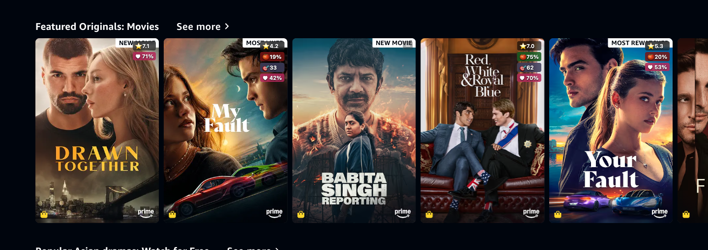
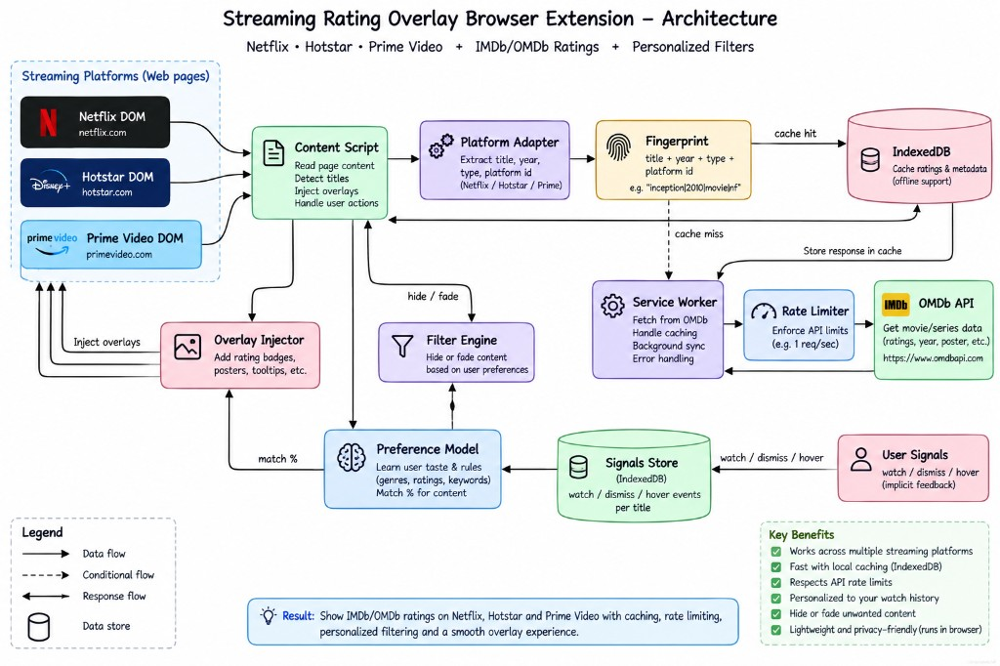
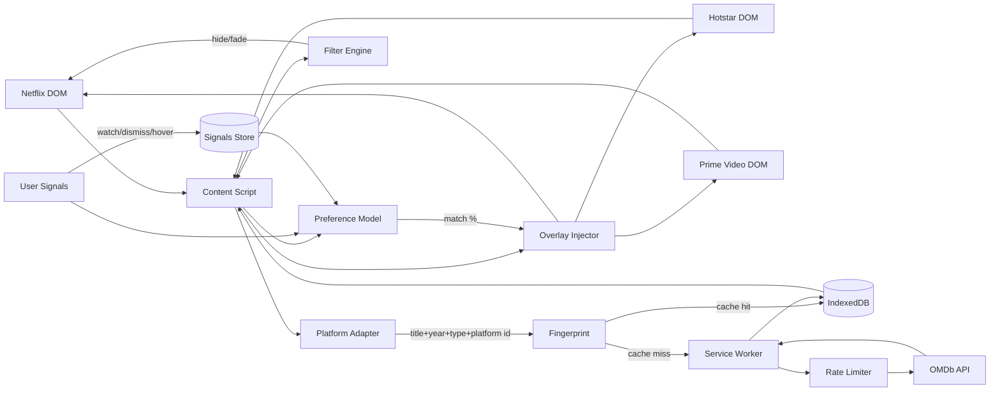

# Decision Layer — Ratings for Netflix, Hotstar & Prime

[](LICENSE)
[](#run-tests)
[](#quick-start)
[](https://developer.chrome.com/docs/extensions/mv3/intro/)

A Manifest V3 Chrome extension that turns streaming catalogs into a decision tool. It overlays IMDb / Rotten Tomatoes / Metacritic ratings on title cards across **Netflix, Jio Hotstar, and Amazon Prime Video**, lets you filter the catalog by rating thresholds, and computes a personalized **"Your match %"** score from in-browser signals. All processing is local — there is no backend server.

## Demo

Badges overlaid on Amazon Prime Video title cards (live page, real OMDb ratings). Each card shows ⭐ IMDb, 🍅 Rotten Tomatoes (red = fresh, splat = rotten), 🎯 Metacritic, and ♥ your personalized match %.



*Example titles visible above: **My Fault** → ⭐ 4.2 · 🍅 19% · 🎯 33 · ♥ 42%; **Red, White & Royal Blue** → ⭐ 7.0 · 🍅 75% · 🎯 62 · ♥ 70%; **Drawn Together** → ⭐ 7.1 · ♥ 71%.*

[Full-page screenshot](overlay-prime.png) · badges render in a Shadow DOM overlay anchored to each card.

## Why this exists

The basic "IMDb rating on Netflix" overlay is a crowded extension category. This project deliberately goes further on two axes: (1) ratings are only **one input** into a decision layer that also filters the catalog and learns your taste, and (2) the extractor is a **per-platform adapter** so the same decision layer runs across multiple streaming sites instead of being Netflix-specific. The defensible product is the personalization + the platform-agnostic core, not the badge.

## Architecture



Streaming-platform DOM (Netflix / Hotstar / Prime Video) → **Content Script** → **Platform Adapter** extracts `{title, year, type, platform id}` → **Fingerprint** (`platform|id|title|year|type`) → IndexedDB cache lookup. On a miss, the **Service Worker** (rate-limited) fetches OMDb, writes the cache, and replies; the content script then injects badges + hover card + match %, and the **Filter Engine** applies thresholds. **User Signals** (hover / click / watched / dismiss) feed the **Preference Model**, whose match % is shown on each card.

<details>
<summary>Equivalent Mermaid flowchart</summary>



</details>

### Platform adapters

Everything site-specific lives behind a `PlatformAdapter` interface (`findCards`, `extractCard`, `getCardId`, `matchesHost`). The shared core — OMDb resolver, IndexedDB cache, overlay, filter, preferences — is platform-agnostic and keyed by a **platform-prefixed fingerprint** so the same title on two different sites never shares a cache entry.

| Platform | Status | Host |
|---|---|---|
| Netflix | ✅ Confirmed on live `netflix.com/browse` (77 cards, all distinct) | `*.netflix.com` |
| Jio Hotstar | ✅ Confirmed on live `hotstar.com/in/movies` (10 cards, slug-keyed) | `*.hotstar.com`, `*.jiocinema.com` |
| Amazon Prime Video | ✅ Confirmed on live `primevideo.com/` (hero cards, ATV-id-keyed, 3-anchor dedup) | `*.primevideo.com`, `*.amazon.com` |

To re-probe a platform against live DOM (e.g. after a site redesign): run the auto-probe (headed Chromium, persistent profile), log in, browse to a card grid, and it auto-dumps selector counts + sample card HTML + a screenshot:

```bash
npm run probe:netflix   # or probe:hotstar / probe:prime
```

Tune `CARD_LINK_SELECTORS` / title sources in `src/content/platforms/<platform>.ts` from the dump. The shared core needs no changes; only the adapter selectors.

### Data flow — single title

1. `MutationObserver` fires on a new card → the active platform adapter pulls `{platform, id, title, year, type}`
2. `fingerprint.ts` builds the cache key from `platform|id|title|year|type` → IndexedDB cache lookup
3. On a miss, the content script sends a `chrome.runtime.sendMessage` to the service worker
4. Service worker: rate-limiter → OMDb fetch → resolver normalizes → write cache → reply
5. Content script: overlay injects badges + hover card + match %
6. Filter engine applies the current thresholds to the card

## Project structure

```
Netflix_imdb_rotten/
  manifest.json                  # MV3 manifest
  src/
    background/
      service-worker.ts          # message router
      omdb-client.ts             # OMDb fetch + normalize
      resolver.ts                # title+year+type -> ratings (with relaxed fallbacks)
      rate-limiter.ts            # token bucket: 1000/day, 10/min burst
    content/
      index.ts                   # entry, observer bootstrap, wires everything
      observer.ts                # MutationObserver + SPA route patching
      extractor.ts               # thin dispatcher -> active platform adapter
      platforms/
        platform.ts              # PlatformAdapter interface + getActivePlatform() registry
        netflix.ts               # Netflix adapter (confirmed)
        hotstar.ts               # Jio Hotstar adapter (scaffolded)
        primevideo.ts            # Amazon Prime Video adapter (scaffolded)
      overlay.ts                 # badge injection (Shadow DOM)
      hover-card.ts              # rich hover panel with deep links
      filter.ts                  # threshold hide/fade
      shadow-host.ts             # Shadow DOM isolation helper
    storage/
      cache.ts                   # IndexedDB (resolved + ratings stores, TTL + SWR)
      settings.ts                # chrome.storage.local settings
      signals.ts                 # user signal ingest + weights
      preferences.ts             # preference vector + cosine match score
    ui/
      options.html / options.ts  # API key, threshold sliders, preference view/reset
      popup.html / popup.ts       # quick toggles + OMDb quota status
    types/
      omdb.ts
      title.ts                   # platform-neutral TitleCard / TitleType
    utils/
      fingerprint.ts             # platform-prefixed fingerprint
  scripts/
    platform-probe.ts            # live DOM probe for any platform (--target=...)
  tests/                          # Vitest unit tests (84 passing)
```

## Quick start

### Prerequisites

- Node 18+ and npm
- Chrome 110+

### Install and build

```bash
npm install
npm run build      # outputs dist/
```

### Load the unpacked extension

1. Open `chrome://extensions`
2. Enable **Developer mode** (top right)
3. Click **Load unpacked** and select the `dist/` folder
4. Open the extension options (click the puzzle-piece → Netflix Decision Layer → ⚙)
5. Enter your OMDb API key (get a free one at <https://www.omdbapi.com/apikey.aspx>) and click **Validate**
6. Visit <https://www.netflix.com> (or <https://www.hotstar.com> / <https://www.primevideo.com>) and browse — badges appear on title cards

### Develop with HMR

```bash
npm run dev
```

CRXJS will rebuild on save. Reload the extension in `chrome://extensions` after the first run.

### Run tests

```bash
npm test            # unit tests (84 passing)
npm run test:watch
npm run test:e2e    # Playwright E2E against a Netflix HTML mock (9 passing)
npm run typecheck   # tsc --noEmit
npm run probe:netflix   # live DOM probe (interactive, headed Chromium)
npm run probe:hotstar
npm run probe:prime
```

The E2E suite loads a Netflix mock page ([e2e/netflix-mock.html](e2e/netflix-mock.html)), stubs the chrome extension APIs, injects the built content script bundle, and asserts on real DOM injection in Chromium — covering badge injection, RT fresh/rotten coloring, per-tile ratings staying distinct (no "same rating on every tile"), filter fade/hide, hover card, preference signal recording, and cold-start match %.

## Key design decisions

### OMDb as the data source (not IMDb scraping)

IMDb's official API is paid (AWS Data Exchange) and IMDb's ToS prohibits scraping. OMDb is a free, ToS-permitted API (1000 requests/day free tier) that returns IMDb rating + Rotten Tomatoes Tomatometer + Metacritic + metadata in a single call. This is the same pattern used by every live Netflix ratings extension. See `docs/data-source.md` for the full trade-off analysis.

### Rotten Tomatoes — critics only in v1

OMDb reliably returns the **Tomatometer (critics %)** but not the RT audience score. In v1 the IMDb user rating is labeled **"Audience (IMDb)"** in the hover card as the audience signal. A separate audience score via TMDB is a planned v2 upgrade.

### Title resolution with relaxed fallbacks

`resolver.ts` queries OMDb with `{title, year, type}` first, then progressively relaxes: drop year, drop type, drop both. This handles remakes, year ambiguity, and Netflix originals. Unresolved titles get a muted `—` badge and are never blocked from rendering.

### Aggressive caching with stale-while-revalidate

Two IndexedDB stores:
- `resolved`: fingerprint → imdbId (TTL **90 days** — a title's IMDb ID never changes)
- `ratings`: imdbId → TitleRatings (TTL **30 days** — IMDb/RT/Metacritic ratings barely move over time)

Ratings are served immediately from cache. If a cached entry is older than **14 days** it's marked stale and a **background refresh** is fired (fire-and-forget, rate-limiter-guarded, deduped per fingerprint) so the cache stays fresh without blocking the UI. This prevents re-hitting OMDb every time Netflix re-renders its DOM (which is frequent — Netflix is a SPA) and means a typical user with hundreds of titles in view will only pay the OMDb cost once per title per month.

### Rate limiting

Token bucket in `chrome.storage.local`: 1000/day OMDb free tier, 10/min burst. In-flight requests are coalesced by fingerprint so duplicate cards share one network call.

### Shadow DOM isolation

All injected UI (badges, hover card) lives inside Shadow DOM so Netflix's CSS never leaks in or out. Selectors use multiple fallbacks (`data-id`, `aria-label`, `.fallback-text`, `a[href*="/title/"]`) because Netflix's DOM changes frequently.

### Personalization model

A lightweight in-browser preference vector over **genres + runtime bucket + decade + type**. Signals: hover (>2s), click, watched, not-for-me, thumbs up/down — each weighted by strength (click > hover). Match score is a weighted blend: 70% genre cosine similarity + 10% runtime + 10% decade + 10% type, scaled to 0–100%.

**Cold start**: until ≥10 signals are recorded, the match % falls back to the IMDb rating × 10 and shows a "warming up" indicator.

## Trade-offs and risks

- **Netflix DOM fragility** — selectors will break on UI redesigns. Mitigated with multiple fallback selectors + `aria-label` + a self-test that logs warnings. No automated alerting yet.
- **OMDb free tier (1k/day)** — aggressive caching + coalescing covers normal browsing. Power users who scroll thousands of titles will hit the limit; the popup surfaces daily quota.
- **OMDb RT data lag** — RT scores via OMDb can lag the RT site. Documented; TMDB is a planned v2 second source.
- **Personalization cold-start** — until ≥10 signals, IMDb rating is the match proxy with a visible "warming up" indicator.
- **Title resolution ambiguity** — unresolved titles are logged to a debug store (planned) so the resolver can be tuned; the UI never blocks on a miss.
- **MV3 service worker lifecycle** — the resolver is stateless; all state lives in IndexedDB / `chrome.storage`. The worker can be killed at any time without data loss.

## Tech stack

- **TypeScript + Vite + `@crxjs/vite-plugin`** — MV3 build with HMR and manifest auto-generation
- **IndexedDB** via the `idb` wrapper
- **chrome.storage.local** for settings + API key (key `ndl_settings` — `sync`'s 1800-writes/10min quota is exhausted by the threshold sliders)
- **Vitest** + **jsdom** for unit tests (84 passing)
- **Shadow DOM** for all injected UI

## Out of scope for v1

- Firefox / Edge port (MV3 Chrome first)
- TMDB integration (v2 — richer metadata + audience score + trailers)
- Server-side preference sync (chrome.storage.sync covers basics)
- **Automated Playwright E2E on a Netflix HTML mock** — implemented (9 tests covering inject, per-tile rating distinctness, filter fade/hide, hover, preference recording, cold-start match)

## License

Licensed under the **MIT License** — see [LICENSE](LICENSE). The license covers the source code only; OMDb data is subject to OMDb's terms, and IMDb / Rotten Tomatoes / Metacritic / Netflix / Hotstar / Prime Video are trademarks of their respective owners. This project is not affiliated with or endorsed by any of them.

## Contributing

Contributions are welcome — especially **platform adapters** for new streaming sites and **selector fixes** when a site redesigns. See [CONTRIBUTING.md](CONTRIBUTING.md).

A few notes for contributors:

- The shared core (resolver, cache, overlay, filter, preferences) is platform-agnostic and keyed by a platform-prefixed fingerprint — only the adapter selectors should need changes when a site's DOM changes.
- Add a `tests/dom-shapes-<platform>.test.ts` from real captured DOM when adding/tuning an adapter.
- Run `npm test` and `npm run typecheck` before opening a PR.
